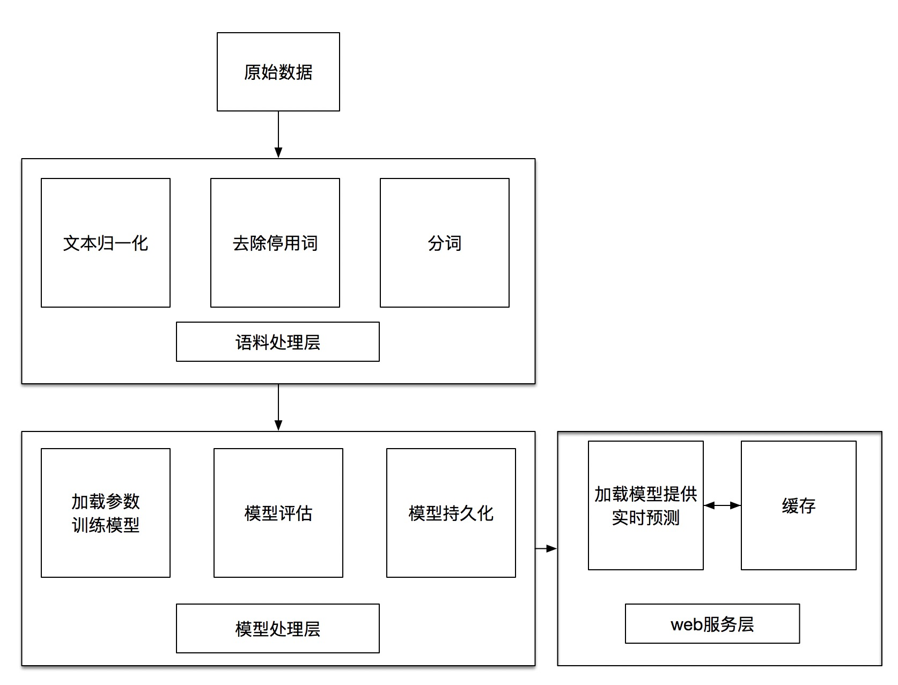

# 手把手教你做最好的电商搜索引擎(1) - 类目预测

## 引言

电商已经在当今我们的生活中扮演中举足轻重的角色，而搜索引擎作为电商系统的主要流量入口，搜索的体验对整个系统起到至关重要的作用，如何优化搜索，让用户搜的更好，更快，已经是一个成熟的电商系统的必修课了。
    
## 搜索的核心和本质

什么是好的电商搜索引擎？

一个优秀的电商搜索引擎的本质其实就是理解用户的需求，帮助用户快速找到想要的商品，并达成交易。

那么，搜索引擎是如何理解用户的意图的呢？常见的方法有3种：

1.基于词典以及模版的规则方法

人工给用户的搜索词分类，比如用户搜索iphone，人工归类到“手机”分类。这种处理方式精准有效，对付一些热门的商品/特殊名词非常有效，但是随着用户越来越多，关键词，包括长尾词，越来越多越复杂，靠人工已经没办法处理那么大的工作量。

2.基于用户行为的统计方法

根据用户的行为，比如用户搜苹果，大部分点了手机、少数人点了水果，根据统计就可以得出苹果的类目依次是：手机 > 水果。
这种方法依赖于用户行为，而且和方法1一样，遇到复杂的词，就很难命中。特别是中文这种博大精深的字顺序错了点点也基本不会影响别人理解的语言。

3.基于机器学习模型来对用户的意图进行判别

随着人工智能的发展壮大，NLP (Natural Language Processing) ,自然语言处理成为AI时代最重要的组成部分。这种主要是通过机器学习及深度学习的方式，对已标注好的领域的语料进行训练学习，得到一个意图识别的模型。利用该模型，当再输入一个测试集时，它能快速地预测出该语料对应的分类，并提供对应的置信度。使用这种方式的一个好处就是，在语料不断丰富后，模型的准确度会不断提升。

今天我们主要聊一聊第3种方式。

### 搜索词处理步骤

电商搜索引擎拿到一个用户的搜索关键词，一般需要进行以下几个处理步骤：

1.文本归一化


常见的操作有：

(1).去除停用词，如：用户不小心输入的特殊符号、标点符号

(2).大小写统一，如：Nike/nike,iphone xr/IPHONE Xr

(3).不同语言转换，如：iphone/苹果手机，阿迪达斯/adidas

2.文本纠错，如：iphoe => iphone

3.分词，如:男士运动卫衣连帽李宁 => 男士 运动 卫衣 连帽 李宁

4.意图识别/中心词识别，如：

“男士运动卫衣连帽李宁”，分词结果：“男士 运动 卫衣 连帽 李宁”

识别结果：

人群：男士
品类：卫衣
品类修饰词： 运动 连帽
品牌： 李宁

5.类目预测/文本分类，如：

男士运动卫衣连帽李宁 => 运动服

睡衣女秋冬 => 女士内衣/家居服

作为NLP领域最经典的使用场景之一，文本分类积累了许多的实现方法，如Facebook开源的FastText、卷积神经网络（CNN）和循环神经网络（RNN）等，这里我们主要看一下基于深度学习的文本分类。

原理我们就不细说了，今天我们主要使用FastText来实践如何进行类目预测。

Let's do it!

## FastText类目预测实践

### 系统架构



### 数据准备

接下来我们开始收集数据吧。

众所周知，机器学习的一大难题，就是收集大量标注好的样本，要保证样本容易处理，更新及时，覆盖全面，不是一件容易的事。

因为我们系统的主要商品来源是淘宝，所以我以淘宝商品为例，类目就使用淘宝的一级类目，文本数据就使用淘宝的商品标题。

差不多是这样的：

| 类目      |  标题  
| :--------  | :----- 
| 美容护肤/美体/精油  | 正品护肤 兰蔻水份缘舒缓柔肤者哩50ml 中样超水妍保湿啫喱凝露水


我们需要一个分词工具，分词有很多工具，比如阿里云、腾讯云等第三方服务，也可以使用结巴分词等开源工具，这里我们使用结巴分词来自建一个http分词接口。

```
$ npm init
$ npm install nodejieba --save
$ vim index.js
```

index.js内容如下:

```js

"use strict";

(function () {
    const queryString = require('querystring'),
         http = require('http'),
         nodejieba = require("nodejieba")

    const port = process.env.PORT || 8800
    const host = process.env.HOST || '0.0.0.0'

    const requestHandler = (request, response) => {
        let query = request.url.split('?')[1]
        let queryObj = queryString.parse(query)
        let result = nodejieba.cut(queryObj.text, true)
        let res = {
            rs: result
        }
        response.setHeader('Content-Type', 'application/json')
        response.end( JSON.stringify(res, null, 2) )
    }

    const server = http.createServer(requestHandler);
    server.listen(port, host, (error) => {
        if (error) {
            console.error(error);
        }
        console.log(`server is listening on ${port}`)
    })
}).call(this)

```

使用pm2运行:

```
$ pm2 start index.js

```

验证分词接口(注意参数要urlencode一次)：

```
$ curl 'http://127.0.0.1:8800/?text=%E4%BF%9D%E6%9A%96%E5%86%85%E8%A1%A3' 

```

得到如下输出，表示接口已经正常工作了:

```
{
  "rs": [
    "保暖",
    "内衣"
  ]
}
```

那上面的商品标题差不多就变成了这样:

```
正品 护肤 兰蔻 水份 缘 舒缓 柔肤者 哩 50 ml 中样 超水妍 保湿 啫喱 凝 露水
```

分词不准确的话，我们可以收集一些电商常用的品牌词和术语等等，保存到分词用户自定义词库(user.dict.utf8文件)中，并重启分词服务即可。


#### 文本样本库


为了方便管理，我们把样本库存到mysql中，让我们建一个mysql表：


```sql
CREATE TABLE `tb_text_train` (
    `item_id` bigint(20) NOT NULL COMMENT '淘宝商品ID',
    `title` varchar(255) DEFAULT NULL COMMENT '淘宝商品标题',
    `level_one_category_name` varchar(255) DEFAULT NULL COMMENT '淘宝商品类目',
    `title_split` varchar(1000) DEFAULT NULL COMMENT '标题分词',
    `done` tinyint(1) DEFAULT '0' COMMENT '样本已处理为1，未处理为0',
    `updatetime` datetime DEFAULT NULL ON UPDATE CURRENT_TIMESTAMP COMMENT '更新时间',
    PRIMARY KEY (`item_id`) USING BTREE
) ENGINE=InnoDB DEFAULT CHARSET=utf8;

```

这样我们就可以采用定时脚本，定期把库里的商品标题处理完（去除停用词，分词），同步到样本库。也可以做一个后台，在后台人工处理标注。

#### 待训练文本处理

文本标注完，我们可以使用sql语句来导出已标注好的数据，按照想要的格式导出为一个data.txt文件，格式如下:

```
__label__传统滋补营养品 茯薏芷湿膏 茯清湿 茶芷湿 茶
__label__男装 秋季 裤子 男 休闲 长裤 韩版 潮流 学生 宽松 束脚 裤百搭 运动裤 男 九分裤
__label__住宅家具 大理石 面 功夫茶 茶几 简约 现代中式 多功能 泡茶 一体桌 客厅 办公室 喝茶
__label__服饰配件/皮带/帽子/围巾 蝴蝶结 禁欲 帽子 夏天 遮阳 防晒 渔夫帽 出游 海边 度假 日系 文艺 女 草帽
__label__女鞋 秋冬 真皮 保暖 豆豆 鞋 平底 休闲女鞋 大码 妈妈 鞋 孕妇 白色 护士 棉鞋 女
__label__居家日用 超声波 驱蚊器 家用 灭蚊 神器 智能 电子 驱蚊 驱虫 器 室内 驱鼠灭 苍蝇 蟑螂
__label__女士内衣/男士内衣/家居服 男士 平角 内裤 纯棉 中老年 爸爸 平角 裤 全棉 裤衩 宽松 老人 加肥加大 裤头

```

格式说明，一行一个：

```
__label__分类名 已经处理好的标题字符串
```

然后我们把整个数据集拆分为2部分，90%做为训练集，10%做为测试集，代码如下:

```
import pandas as pd
import numpy as np

# 语料数据集存放路径
data_path = "/usr/local/webdata/fastText/"

# 读取语料数据集文本文件
train = pd.read_csv(data_path+"data.txt", header=0, sep='\r\n', engine='python')
ts =  train.shape

# 打乱数据集，拆分为训练集train.txt和测试集test.txt
df = pd.DataFrame(train)
new_train = df.reindex(np.random.permutation(df.index))

# 训练集和测试集比例为9:1
indice_90_percent = int((ts[0]/100.0)* 90)

# 打散到2个文件中
new_train[:indice_90_percent].to_csv(data_path+'train.txt',index=False)
new_train[indice_90_percent:].to_csv(data_path+'test.txt',index=False)
```

#### 使用fastText训练


1.安装fasttext:

fasttext安装非常简单：

```
$ git clone https://github.com/facebookresearch/fastText.git
$ cd fastText
$ make
$ pip install .
```

2.使用fasttext训练:

使用命令行运行训练:

```
$ ./fasttext supervised -input train.txt -output model -label __label__ -epoch 50 -wordNgrams 3 -dim 100 -lr 0.5 -loss hs
```

或者写python程序调用fasttext模块：

```
import fasttext
model = fasttext.train_supervised(input="model",
                                lr=0.5,
                                epoch=100,
                                wordNgrams=3,
                                dim=100,
                                loss='hs')
```

模型训练结束后，会生成模型文件model.bin, 文本向量文件model.vec。

3.验证数据集

训练的差不多了，让我们用测试集来检查一下，是骡子是马拉出来遛遛。

```
$ ./fasttext test model.bin test.txt
```

会出现以下的结果：

```
N   1892209
P@1 0.982
R@1 0.982

```

恩，看起来不错。

我们用实际的用户搜索词来试一下吧, 比如刚才我们分词“保暖内衣”，得到的分词结果是“保暖 内衣”，那么提交给fasttext预测就是这样的：

```
$ echo '保暖 内衣' | ./fasttext predict model.bin -

```

稍等片刻，就可以得到这样的结果：

```
__label__女士内衣/男士内衣/家居服

```

bingo，预测非常完美！


Tips:
默认生成的model.bin文件会很大，可以使用quantize命令来压缩模型文件:

```
$ ./fasttext quantize -output model
```

会生成体积大幅减少的model.ftz文件，测试下来效果很显著，比如我这里由4.7G变成了616MB，很棒~~

```
4.7G    model.bin
616M    model.ftz
60K     model.o
6.1G    model.vec
```

使用方式和model.bin一样，如：

```
$ ./fasttext test model.ftz test.txt
$ echo '保暖 内衣' | ./fasttext predict model.ftz -
```

4.提供web服务

为了更方便地使用预测服务，我们把预测功能也做成一个http接口，还是使用nodejs。

```
$ npm install fasttext.js --save
$ vim server.js

```

server.js内容如下：

```js


"use strict";

(function () {

    const queryString = require('querystring'),
        FastText = require('fasttext.js'),
        http = require('http')

    const port = process.env.PORT || 8801
    const host = process.env.HOST || '0.0.0.0'

    const fastText = new FastText({
        loadModel: '/usr/local/webdata/fastText/model.ftz'
    })


    const requestHandler = (request, response) => {
        let query = request.url.split('?')[1]
        let queryObj = queryString.parse(query)

        fastText.predict(queryObj.text)
            .then(labels => {
                let res = {
                    predict: labels
                }
                response.setHeader('Content-Type', 'application/json')
                response.end( JSON.stringify(res, null, 2) )
            })
            .catch(error => {
                console.error("predict error", error)
            })
    }

    const server = http.createServer(requestHandler)
    
    fastText.load()
    .then(done => {
        console.log("model loaded")
        server.listen(port, host, (error) => {
            if (error) {
                console.error(error)
            }
            console.log(`server is listening on ${port}`)
        })
    })
    .catch(error => {
        console.error("load error", error)
    });


}).call(this)

```

同样，我们使用pm2来启动服务：

```
$ pm2 start server.js
```

验证一下效果（注意参数要先用上面的分词接口分词，再urlencode一次）：

```
$ curl 'http://127.0.0.1:8801/?text=%E4%BF%9D%E6%9A%96%20%E5%86%85%E8%A1%A3'
```

得到这样的结果: 

```
{
  "predict": [
    {
      "label": "女士内衣/男士内衣/家居服",
      "score": "1.00005"
    },
    {
      "label": "童装/婴儿装/亲子装",
      "score": "0.0543005"
    }
  ]
}
```

好像效果很不错哦，选用score值最大的基本上就满足需求了。

## 总结

经过上面简单的几步，我们已经成功搭建了一套淘宝商品分类预测服务，包含分词系统、分类预测系统。把这些服务集成到我们的搜索功能中，我们的搜索就更准了，用户就买得更开心了。


## 参考

[FastText](https://fasttext.cc/)
[fasttext.js](https://github.com/loretoparisi/fasttext.js)
[结巴中文分词](https://github.com/fxsjy/jieba)
